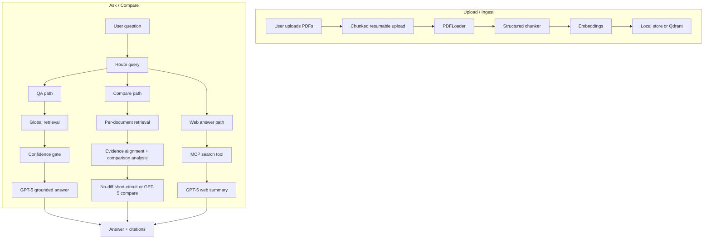

# DocCompare AI

Luc1ferxx Archive is a multi-document RAG workspace built with React and Node.js. Users can upload PDFs, ask grounded questions, compare multiple documents, inspect citations in an inline PDF preview, and contrast document answers with a live web-search answer.

The project uses LangChain as the infrastructure layer for PDF loading, embeddings, and model calls, while the retrieval, comparison, confidence, upload, and evaluation logic are custom.

## What It Does

- Upload one or more PDFs with resumable chunked upload
- Ask document-grounded questions with citations
- Compare multiple documents with a dedicated compare-aware retrieval path
- Preview cited pages inside the app
- Run a second answer path from live web search through MCP
- Persist documents, vector data, and session memory across restarts

## Flow



## Core RAG Logic

### QA

1. Embed the user query
2. Retrieve top chunks across the selected documents
3. Optionally rerank the retrieved candidates after retrieval / hybrid fusion and before the confidence gate
4. Run a confidence gate
5. Build the source bundle and ask GPT-5 for a concise grounded answer with citations

### Compare

1. Embed the user query once
2. Retrieve evidence per document instead of global top-k
3. Optionally rerank candidates within each document before evidence alignment
4. Align evidence across documents
5. Analyze shared terms, near-duplicate signals, and evidence balance
6. If all evidence is highly similar and conflict-free, short-circuit to a deterministic no-difference answer
7. Otherwise ask GPT-5 to write a structured comparison

### Optional Rerank

Rerank is disabled by default (`RAG_RERANK_ENABLED=false`). When enabled, it runs after the retrieval stage (after dense + sparse hybrid fusion when hybrid retrieval is enabled) and before the confidence gate. The retriever first expands the candidate set to `candidateK = topK * RAG_RERANK_CANDIDATE_MULTIPLIER`, reranks those candidates, and then truncates back to the final top-k.

QA uses one global rerank across the selected documents. Compare uses per-document rerank: each selected document expands, reranks, and truncates its own candidates independently so a strong document cannot push another document out through cross-document mixing. `RAG_RERANK_WEIGHT` controls the mixed score between the original retrieval / hybrid score and the heuristic `rerankScore`.

### RAG Observability

RAG observability is disabled by default (`RAG_OBSERVABILITY_ENABLED=false`). When enabled, each QA or compare chat request appends one structured JSONL event to `server/data/rag-observability/events.jsonl` by default. The trace captures retrieval scores, rerank score fields when present, confidence-gate decisions, compare evidence summaries, and the final source bundle.

For privacy, `RAG_OBSERVABILITY_INCLUDE_CONTEXT=false` by default. In that mode traces store document metadata, scores, `excerptHash`, and an `excerptPreview` capped at 120 characters, but not full chunk `text` / `pageContent`. Set `RAG_OBSERVABILITY_INCLUDE_CONTEXT=true` only for local debugging when recording full retrieved chunk text is acceptable.

### Web Answer

1. Call a local MCP server
2. Use SerpAPI-backed search results
3. Ask GPT-5 to summarize the web evidence separately from the document answer

## Why This Design

- Standard RAG often fails on multi-document comparison because one document can dominate global top-k retrieval
- This project routes comparison questions into a dedicated per-document retrieval path
- Evidence stays document-aware through the full compare pipeline
- Confidence gates reduce low-evidence answers
- A near-duplicate no-difference guard reduces unnecessary compare hallucinations on highly similar documents

## Main Features

- Structured chunking using page, heading, paragraph, and sentence boundaries
- Local persisted vector index with optional Qdrant backend
- Optional hybrid retrieval with dense + sparse fusion
- Compare-aware retrieval that preserves document fairness
- Evidence alignment before comparison generation
- Resumable uploads with saved chunk state
- Synthetic and real-corpus evaluation harnesses

## Repository Layout

- `src/`: React frontend
- `server/`: Express backend
- `server/rag/`: custom RAG pipeline
- `server/evaluation/`: synthetic and real evaluation harnesses
- `server/mcp-server.js`: local MCP search server

## Setup

Install frontend dependencies from the repo root:

```powershell
cmd /c npm.cmd install
```

Install backend dependencies:

```powershell
cd server
cmd /c npm.cmd install
cd ..
```

Install optional Python dependencies for `ragas` evaluation:

```powershell
cd server
python -m venv evaluation\.venv-ragas
evaluation\.venv-ragas\Scripts\python.exe -m pip install -r evaluation\ragas-requirements.txt
cd ..
```

Create `server/.env` from `server/.env.example` and fill in the required keys:

```env
OPENAI_API_KEY=your_openai_api_key
SERPAPI_KEY=your_serpapi_key
VECTOR_STORE_PROVIDER=local
OPENAI_EMBEDDING_MODEL=text-embedding-3-small
OPENAI_CHAT_MODEL=gpt-5
RAG_PROMPT_VERSION=v3
RAG_CHUNK_STRATEGY=structured
RAG_HYBRID_ENABLED=false
RAG_RERANK_ENABLED=false
RAG_RERANK_CANDIDATE_MULTIPLIER=3
RAG_RERANK_WEIGHT=0.6
RAG_OBSERVABILITY_ENABLED=false
RAG_OBSERVABILITY_INCLUDE_CONTEXT=false
RAG_CHUNK_SIZE=900
RAG_CHUNK_OVERLAP=180
RAG_RETRIEVAL_TOP_K=6
RAG_SPARSE_TOP_K=8
RAG_COMPARE_TOP_K_PER_DOC=3
RAG_MIN_RELEVANCE_SCORE=0.32
RAG_MIN_QUERY_TERM_COVERAGE=0.51
RAG_NEAR_DUPLICATE_GUARD_ENABLED=true
```

Notes:

- `OPENAI_API_KEY` is required for embeddings and answer generation
- `SERPAPI_KEY` is required for the MCP web answer path
- `VECTOR_STORE_PROVIDER` supports `local` and `qdrant`
- `RAG_RERANK_ENABLED` is disabled by default; when enabled, rerank runs after retrieval / hybrid fusion and before the confidence gate
- `RAG_RERANK_CANDIDATE_MULTIPLIER` expands candidate recall before rerank with `candidateK = topK * multiplier`; rerank then truncates back to the final top-k
- `RAG_RERANK_WEIGHT` controls the final mixed score between the original retrieval / hybrid score and the heuristic `rerankScore`
- QA reranks globally across selected documents; compare reranks independently within each document to avoid cross-document mixing
- `RAG_NEAR_DUPLICATE_GUARD_ENABLED` controls the no-difference short-circuit on highly similar compare evidence

## Run

Start frontend and backend together from the repo root:

```powershell
cmd /c npm.cmd run dev
```

Default local ports:

- frontend: `3000`
- backend: `5001`

## Evaluation

This repo uses a custom Node evaluation harness as the source-of-truth regression runner. It ingests the test corpus through the same upload / chunk / retrieval pipeline as the app, runs `chat(...)` end to end, and scores each case with project-specific checks for:

- abstain behavior
- document and page citation coverage
- expected answer fragments
- latency and citation count

`ragas` runs as a second pass on top of the saved Node payloads. It is useful for semantic QA diagnostics and retrieval grounding, but compare quality is still primarily judged by the custom harness plus the compare rubric in `latest-ragas.*`.

Run the default synthetic evaluation:

```powershell
cd server
cmd /c npm.cmd run eval:synthetic
```

Run the near-duplicate compare corpus:

```powershell
cd server
cmd /c "set VECTOR_STORE_PROVIDER=local&& npm.cmd run eval:synthetic -- evaluation/synthetic-corpus-near-duplicate.json"
```

Run the harder compare corpus:

```powershell
cd server
cmd /c "set VECTOR_STORE_PROVIDER=local&& npm.cmd run eval:synthetic -- evaluation/synthetic-corpus-compare-hard.json"
```

Run the chunking comparison corpus:

```powershell
cd server
cmd /c "set VECTOR_STORE_PROVIDER=local&& set RAG_CHUNK_STRATEGY=structured&& set RAG_CHUNK_OVERLAP=180&& npm.cmd run eval:synthetic -- evaluation/synthetic-corpus-chunking.json"
```

Run a real-document evaluation:

```powershell
cd server
cmd /c npm.cmd run eval:real -- evaluation/real-corpus.json
```

Run `ragas` against the latest saved Node evaluation:

```powershell
cd server
evaluation\.venv-ragas\Scripts\python.exe evaluation\run-ragas-eval.py --input evaluation\results\latest.json
```

Run `ragas` against the hard compare report:

```powershell
cd server
evaluation\.venv-ragas\Scripts\python.exe evaluation\run-ragas-eval.py --input evaluation\results\compare-hard.json --output-json evaluation\results\compare-hard-ragas.json --output-md evaluation\results\compare-hard-ragas.md
```

Saved reports are written to `server/evaluation/results/`.

- `latest.json` and `latest.md` come from the Node evaluation harness
- `latest-ragas.json` and `latest-ragas.md` come from the Python `ragas` pass
- `compare-hard.json` / `compare-hard.md` and `compare-hard-ragas.json` / `compare-hard-ragas.md` are the tracked harder compare benchmark artifacts
- The Node result payload now includes `retrievedContexts`, `referenceContexts`, `retrieved_context_ids`, `reference_context_ids`, and a normalized `ragasSample` per case so `ragas` can score the same run without re-querying the app

## Quantitative Results

### Chunking Benchmark

The clearest accuracy improvement in this project came from moving from simple fixed-window chunking to the current structured chunker on `evaluation/synthetic-corpus-chunking.json`.

| Metric | Before: simple `900/0` | After: structured `900/180` |
| --- | ---: | ---: |
| Overall pass rate | 0.5 | 1 |
| QA page hit rate | 0.3333 | 1 |
| Compare doc coverage | 0.3333 | 1 |
| Compare page hit rate | 0.3333 | 1 |
| Answer content hit rate | 0.3333 | 1 |
| Upload resume success rate | 1 | 1 |
| Avg response time (ms) | 1310.63 | 3649.63 |
| Avg citation count | 0.5 | 1.5 |

This tradeoff is intentional: the structured chunker is slower, but it keeps better-grounded evidence in play and improves both QA and compare accuracy.

### Latest Tracked Eval

The current tracked `latest.*` report comes from `evaluation/synthetic-corpus-near-duplicate.json` and reports:

- `overallPassRate`: `1.0`
- `qaPageHitRate`: `1.0`
- `compareDocCoverageRate`: `1.0`
- `comparePageHitRate`: `1.0`
- `abstainAccuracy`: `1.0`
- `answerContentHitRate`: `1.0`
- `averageResponseTimeMs`: `6254.63`
- `averageCitationCount`: `1.63`

### Latest `ragas` Eval

The current tracked `latest-ragas.*` report on the same near-duplicate corpus reports:

- overall: `answerRelevancy=0.6171`, `faithfulness=0.8`, `contextUtilization=1.0`, `contextPrecision=1.0`, `contextRecall=0.8333`, `compareRubric=0.95`
- `qa` route: `answerRelevancy=0.6724`, `faithfulness=1.0`, `contextUtilization=1.0`, `contextPrecision=1.0`, `contextRecall=1.0`
- `compare` route: `answerRelevancy=0.5895`, `faithfulness=0.7`, `contextUtilization=1.0`, `contextPrecision=1.0`, `contextRecall=0.75`, `compareRubric=0.95`

### Hard Compare Benchmark

The tracked `compare-hard.*` report comes from `evaluation/synthetic-corpus-compare-hard.json` and is meant to stress compare behavior beyond near-duplicates. The current Node harness report is:

- `overallPassRate`: `1.0`
- `qaPageHitRate`: `1.0`
- `compareDocCoverageRate`: `1.0`
- `comparePageHitRate`: `1.0`
- `abstainAccuracy`: `1.0`
- `answerContentHitRate`: `1.0`
- `averageResponseTimeMs`: `16158.75`
- `averageCitationCount`: `1.88`

The current `compare-hard-ragas.*` report is:

- overall: `answerRelevancy=0.6658`, `faithfulness=0.8939`, `contextUtilization=0.9286`, `contextPrecision=1.0`, `contextRecall=0.8571`, `compareRubric=0.9333`
- `compare` route: `answerRelevancy=0.6758`, `faithfulness=0.8762`, `contextUtilization=0.9167`, `contextPrecision=1.0`, `contextRecall=0.8333`, `compareRubric=0.9333`

This project still treats the custom Node metrics as the source of truth for abstain behavior, page-level evidence coverage, and compare-specific correctness. `ragas` is used as a semantic supplement, especially for QA quality and retrieval grounding, not as a replacement for the compare harness.

## Current Limits

- The compare router is still keyword-based
- Real-conflict compare cases still depend on GPT-5, so they can be slower than QA
- The local vector store is fine for small workloads, but Qdrant is the better path for larger corpora
- Real-document evaluation still depends on a user-supplied corpus

## Security Notes

- Do not commit `server/.env`
- Do not commit private uploaded documents
- Use `server/.env.example` as the public config template
