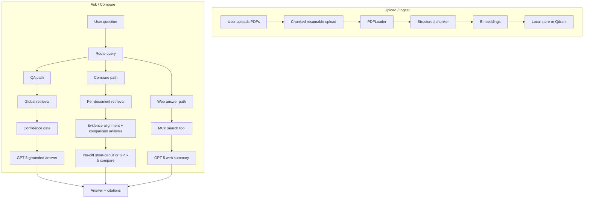

# Luc1ferxx Archive

Luc1ferxx Archive is a multi-document RAG workspace built with React and Node.js. Users can upload PDFs, ask grounded questions, compare multiple documents, inspect citations in an inline PDF preview, and contrast document answers with a live web-search answer.

The project uses LangChain as the infrastructure layer for PDF loading, embeddings, and model calls, while the retrieval, comparison, confidence, upload, and evaluation logic are custom.

## What It Does

- Upload one or more PDFs with resumable chunked upload
- Ask document-grounded questions with citations
- Compare multiple documents with a dedicated compare-aware retrieval path
- Preview cited pages inside the app
- Run a second answer path from live web search through MCP
- Persist documents, vector data, and session memory across restarts

## Flow



## Core RAG Logic

### QA

1. Embed the user query
2. Retrieve top chunks across the selected documents
3. Run a confidence gate
4. Ask GPT-5 for a concise grounded answer with citations

### Compare

1. Embed the user query once
2. Retrieve evidence per document instead of global top-k
3. Align evidence across documents
4. Analyze shared terms, near-duplicate signals, and evidence balance
5. If all evidence is highly similar and conflict-free, short-circuit to a deterministic no-difference answer
6. Otherwise ask GPT-5 to write a structured comparison

### Web Answer

1. Call a local MCP server
2. Use SerpAPI-backed search results
3. Ask GPT-5 to summarize the web evidence separately from the document answer

## Why This Design

- Standard RAG often fails on multi-document comparison because one document can dominate global top-k retrieval
- This project routes comparison questions into a dedicated per-document retrieval path
- Evidence stays document-aware through the full compare pipeline
- Confidence gates reduce low-evidence answers
- A near-duplicate no-difference guard reduces unnecessary compare hallucinations on highly similar documents

## Main Features

- Structured chunking using page, heading, paragraph, and sentence boundaries
- Local persisted vector index with optional Qdrant backend
- Optional hybrid retrieval with dense + sparse fusion
- Compare-aware retrieval that preserves document fairness
- Evidence alignment before comparison generation
- Resumable uploads with saved chunk state
- Synthetic and real-corpus evaluation harnesses

## Repository Layout

- `src/`: React frontend
- `server/`: Express backend
- `server/rag/`: custom RAG pipeline
- `server/evaluation/`: synthetic and real evaluation harnesses
- `server/mcp-server.js`: local MCP search server

## Setup

Install frontend dependencies from the repo root:

```powershell
cmd /c npm.cmd install
```

Install backend dependencies:

```powershell
cd server
cmd /c npm.cmd install
cd ..
```

Create `server/.env` from `server/.env.example` and fill in the required keys:

```env
OPENAI_API_KEY=your_openai_api_key
SERPAPI_KEY=your_serpapi_key
VECTOR_STORE_PROVIDER=local
OPENAI_EMBEDDING_MODEL=text-embedding-3-small
OPENAI_CHAT_MODEL=gpt-5
RAG_PROMPT_VERSION=v3
RAG_CHUNK_STRATEGY=structured
RAG_HYBRID_ENABLED=false
RAG_CHUNK_SIZE=900
RAG_CHUNK_OVERLAP=180
RAG_RETRIEVAL_TOP_K=6
RAG_SPARSE_TOP_K=8
RAG_COMPARE_TOP_K_PER_DOC=3
RAG_MIN_RELEVANCE_SCORE=0.32
RAG_MIN_QUERY_TERM_COVERAGE=0.51
RAG_NEAR_DUPLICATE_GUARD_ENABLED=true
```

Notes:

- `OPENAI_API_KEY` is required for embeddings and answer generation
- `SERPAPI_KEY` is required for the MCP web answer path
- `VECTOR_STORE_PROVIDER` supports `local` and `qdrant`
- `RAG_NEAR_DUPLICATE_GUARD_ENABLED` controls the no-difference short-circuit on highly similar compare evidence

## Run

Start frontend and backend together from the repo root:

```powershell
cmd /c npm.cmd run dev
```

Default local ports:

- frontend: `3000`
- backend: `5001`

## Evaluation

Run the default synthetic evaluation:

```powershell
cd server
cmd /c npm.cmd run eval:synthetic
```

Run the near-duplicate compare corpus:

```powershell
cd server
cmd /c "set VECTOR_STORE_PROVIDER=local&& npm.cmd run eval:synthetic -- evaluation/synthetic-corpus-near-duplicate.json"
```

Run the chunking comparison corpus:

```powershell
cd server
cmd /c "set VECTOR_STORE_PROVIDER=local&& set RAG_CHUNK_STRATEGY=structured&& set RAG_CHUNK_OVERLAP=180&& npm.cmd run eval:synthetic -- evaluation/synthetic-corpus-chunking.json"
```

Run a real-document evaluation:

```powershell
cd server
cmd /c npm.cmd run eval:real -- evaluation/real-corpus.json
```

Saved reports are written to `server/evaluation/results/`. The tracked `latest.*` files currently come from the dedicated near-duplicate compare corpus.

## Current Limits

- The compare router is still keyword-based
- Real-conflict compare cases still depend on GPT-5, so they can be slower than QA
- The local vector store is fine for small workloads, but Qdrant is the better path for larger corpora
- Real-document evaluation still depends on a user-supplied corpus

## Security Notes

- Do not commit `server/.env`
- Do not commit private uploaded documents
- Use `server/.env.example` as the public config template
